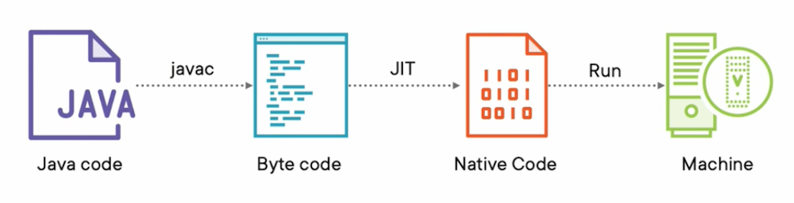
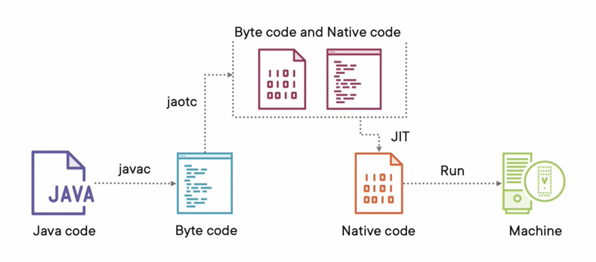

<h3 align="center">Real-Estatetor</h3>

<div align="center">

  []() 
  [](https://github.com/kylelobo/The-Documentation-Compendium/issues)
  [](https://github.com/kylelobo/The-Documentation-Compendium/pulls)
  [](/LICENSE)

</div>

---
### Biography  

**Authors:**  
Jordi Jaspers [[Github](https://github.com/Jordi-Jaspers "Github Page"), [Linkedin](https://www.linkedin.com/in/jordi-jaspers/ "Linkedin Page")]  
  
**Date of initial commit:** 24/01/2022

---

## 📝 Table of Contents
- [Application](#application)
- [Set-Up](#setup)
- [Notes](#notes)
- [Stack](#stack)
- [References](#references)

## Application <a name = "application"></a>

**Description:**  
A simple Real-estate website GUI made in React and tailwind CSS. This will provide as the foundation for solidity and micronaut experiments. The backend is a fully reactive microservice using an R2DB connection with postgres and implementing Webflux capabilities.

**Endpoints**
```text
Created Route: GET /rest/property -> PropertyController#getAllProperties ()
Created Route: HEAD /rest/property -> PropertyController#getAllProperties ()
Created Route: GET /rest/property/{id} -> PropertyController#getProperty ()
Created Route: HEAD /rest/property/{id} -> PropertyController#getProperty ()
Created Route: GET /rest/property/search -> PropertyController#getPropertyInPriceRange ()
Created Route: HEAD /rest/property/search -> PropertyController#getPropertyInPriceRange ()
Created Route: POST /rest/property -> PropertyController#CreatePropertyAdvertisement (application/json)
Created Route: POST /login -> $LoginController$Definition$Intercepted#login (application/x-www-form-urlencoded,application/json)
Created Route to @Endpoint io.micronaut.management.endpoint.loggers.LoggersEndpoint: POST /loggers/{name} -> LoggersEndpoint#setLogLevel ()
Created Route to @Endpoint io.micronaut.management.endpoint.refresh.RefreshEndpoint: POST /refresh -> RefreshEndpoint#refresh ()
Created Route to @Endpoint io.micronaut.management.endpoint.stop.ServerStopEndpoint: POST /stop -> ServerStopEndpoint#stop ()
Created Route to @Endpoint io.micronaut.management.endpoint.beans.BeansEndpoint: GET /beans -> BeansEndpoint#getBeans ()
Created Route to @Endpoint io.micronaut.management.endpoint.beans.BeansEndpoint: HEAD /beans -> BeansEndpoint#getBeans ()
Created Route to @Endpoint io.micronaut.management.endpoint.env.EnvironmentEndpoint: GET /env -> EnvironmentEndpoint#getEnvironmentInfo ()
Created Route to @Endpoint io.micronaut.management.endpoint.env.EnvironmentEndpoint: HEAD /env -> EnvironmentEndpoint#getEnvironmentInfo ()
Created Route to @Endpoint io.micronaut.management.endpoint.env.EnvironmentEndpoint: GET /env/{propertySourceName} -> EnvironmentEndpoint#getProperties ()
Created Route to @Endpoint io.micronaut.management.endpoint.env.EnvironmentEndpoint: HEAD /env/{propertySourceName} -> EnvironmentEndpoint#getProperties ()
Created Route to @Endpoint io.micronaut.management.endpoint.health.HealthEndpoint: GET /health -> HealthEndpoint#getHealth ()
Created Route to @Endpoint io.micronaut.management.endpoint.health.HealthEndpoint: HEAD /health -> HealthEndpoint#getHealth ()
Created Route to @Endpoint io.micronaut.management.endpoint.health.HealthEndpoint: GET /health/{selector} -> HealthEndpoint#getHealth ()
Created Route to @Endpoint io.micronaut.management.endpoint.health.HealthEndpoint: HEAD /health/{selector} -> HealthEndpoint#getHealth ()
Created Route to @Endpoint io.micronaut.management.endpoint.info.InfoEndpoint: GET /info -> InfoEndpoint#getInfo ()
Created Route to @Endpoint io.micronaut.management.endpoint.info.InfoEndpoint: HEAD /info -> InfoEndpoint#getInfo ()
Created Route to @Endpoint io.micronaut.management.endpoint.loggers.LoggersEndpoint: GET /loggers -> LoggersEndpoint#loggers ()
Created Route to @Endpoint io.micronaut.management.endpoint.loggers.LoggersEndpoint: HEAD /loggers -> LoggersEndpoint#loggers ()
Created Route to @Endpoint io.micronaut.management.endpoint.loggers.LoggersEndpoint: GET /loggers/{name} -> LoggersEndpoint#logger ()
Created Route to @Endpoint io.micronaut.management.endpoint.loggers.LoggersEndpoint: HEAD /loggers/{name} -> LoggersEndpoint#logger ()
Created Route to @Endpoint io.micronaut.management.endpoint.routes.RoutesEndpoint: GET /routes -> RoutesEndpoint#getRoutes ()
Created Route to @Endpoint io.micronaut.management.endpoint.routes.RoutesEndpoint: HEAD /routes -> RoutesEndpoint#getRoutes ()
```

## Set-Up <a name = "setup"></a>

1. Install the latest version of SDKMAN! [sdkman](https://sdkman.io/install)
2. Install Java version `sdk install java  22.0.0.2.r17-grl` from SDKMAN.
3. When using IntelliJ IDE:
   1. Setup IDE config to gradle jdk 17-grl -> preferences -> build, execution, and deployment -> build tools -> gradle -> JDK
   2. Set project structure to jdk 17-grl
4. CD to Liquibase project folder and run `./gradlew liquibase:update` to provision the database.
5. CD to the `backend` folder and run `./gradlew clean build` to build the backend OR `./gradlew run` to run the backend.
6. Create a Native Image of the backend by using `./gradlew native-image`

## Notes <a name = "notes"></a>

### Pros and Cons
* Small community, debugging is harder.
* Quarkus has no groovy support and is also slower than Micronaut.
* Security is not an out-of-the-box feature like in spring boot.
* Production time decreases because Micronaut is a different way of working.

### Micronaut Vs. Spring
Hawaii framework depends on Spring framework dependencies & Bean annotations, which is not very efficient for micronaut's native image 
support with GraalVM. The downsides with Springs are:



Heavily depends on annotations, which creates generates reflective metadata for each and every bean before carrying out dependecy injection. Therefore, all that runtime information will be stored in a reflective cache. Hence, the memory usage will be significantly higher.

Spring uses JIT (=Just in time) compilation, meaning that java code is compiled to bytecode. Bytecode itself cannot be run on a machine, so we need a JVM to compile it to native code. JIT only compiles the byte code it needs in order to execute certain tasks. But in order to run the application needs its reflective caches which also need to be compiled to native code. Like stated above, The reflective caches are used so the JIT compilation time is huge, resulting in a slow start-up time.



Micronaut uses AOT (Ahead Of Time Compilation) which means that bytecode is compiled to native code where possible. resulting in a hybride code of byte code and native code. This code has less of an impact for the JIT compiler to compile the remaining byte code.
It provides the goodness of Spring, but reflection-free as much as possible

### Nassau Framework
In spring boot application we usually used "Hawaii Framework" to have proper exception handling and logging. but because it relies on Spring's reflective beans, it is incompatible with Micronaut. Therefore, I am developing a Nassau Framework which is a lightweight framework that is compatible with Micronaut.

```groovy
    // ======= HAWAII FRAMEWORK =======

    // contains the autoconfiguration for Hawaii logging.
    implementation(group = "org.hawaiiframework", name = "hawaii-starter-logging", version = "3.0.0.M24")

    // provides the core of hawaii framework such as the response entity exception handling.
    implementation("org.hawaiiframework", name = "hawaii-core", version = "3.0.0.M24")

    // provides an async framework which enables us to control query and rest endpoints timeouts.
    implementation("org.hawaiiframework", name = "hawaii-async", version = "3.0.0.M24")

    // contains the autoconfiguration of the exception mapping to http error codes. Also provides for JSON-org dependency.
    implementation(group = "org.hawaiiframework", name = "hawaii-starter-rest", version = "3.0.0.M24")

    // Provides basic Spring MVC capabilities, and is necessary for hawaii-framework.
    // To indicate this is a web/rest application, but do not load tomcat, we will replace it with Jetty later
    implementation(group = "org.springframework.boot", name = "spring-boot-starter-web", version = "2.6.2") {
        exclude(group = "org.springframework.boot", module = "spring-boot-starter-tomcat")
    }

    // JCL 1.2 implemented over SLF4J
    // https://mvnrepository.com/artifact/org.slf4j/jcl-over-slf4j
    implementation("org.slf4j:jcl-over-slf4j:1.7.35")
```

## ⛏️ Stack <a name = "stack"></a>
- [Micronaut](https://micronaut.io/) - Microservices framework for Spring Boot
- [Liquibase](https://www.liquibase.org/) - Database migration tool
- [WebFlux](https://projectreactor.io/docs/core/release/reference/index.html) - Reactive web framework
- [R2DBC](https://r2dbc.io/) - Reactive database client
- [Git](https://git-scm.com/) - Version Control
- [Solidity](https://soliditylang.org/) - Ethereum Smart Contract
- [React](https://reactjs.org/) - Frontend Framework

## ✍️ References <a name = "references"></a>
* Troubleshooting: <https://stackoverflow.com/>
* Spring Boot: <https://spring.io/projects/spring-boot>
* React course (Brad Traversy): <https://www.youtube.com/watch?v=w7ejDZ8SWv8>
* Git Ignore generator:<https://www.toptal.com/developers/gitignore>
* Micronaut Docs: <https://micronaut.io/docs/>
* Reactive DB Micronaut: <https://medium.com/javarevisited/reactive-database-access-with-r2dbc-micronaut-and-graalvm-ee9b5853260>
* GraalVM: <https://www.graalvm.org/>
* Solidity Docs: <https://solidity.readthedocs.io/en/develop/getting-started.html>
* Heroicons (icon resource): <https://heroicons.com/>
* Unsplash (image Resource): <https://unsplash.com/>
* Micronaut R2DBC guide: <https://micronaut-projects.github.io/micronaut-r2dbc/1.0.x/guide/>
